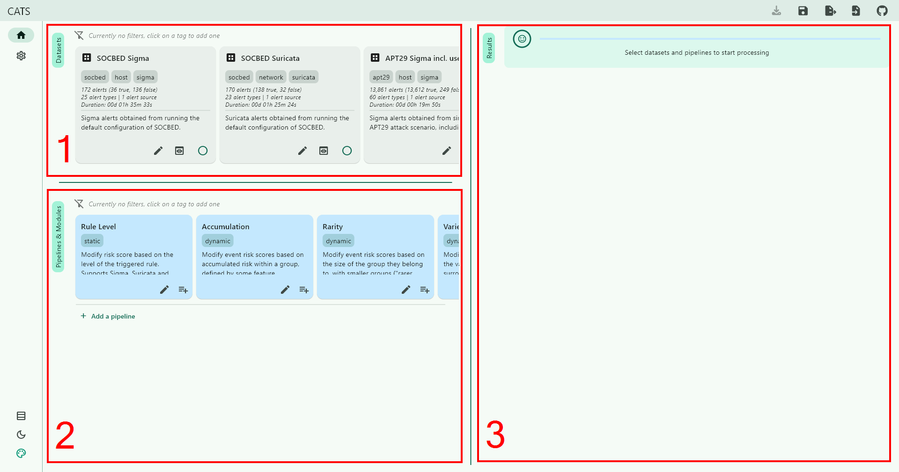
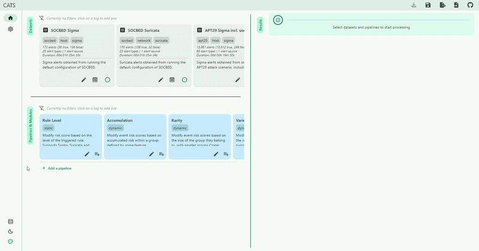
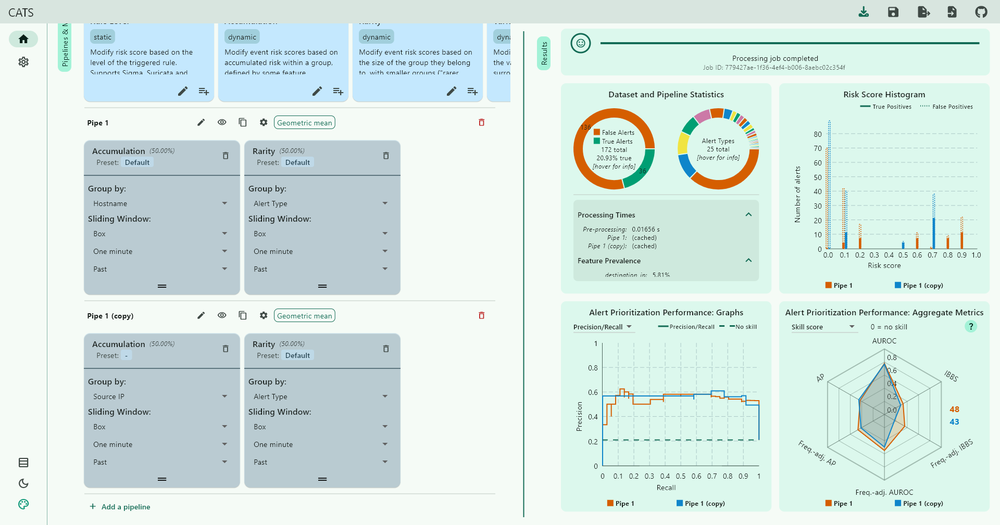
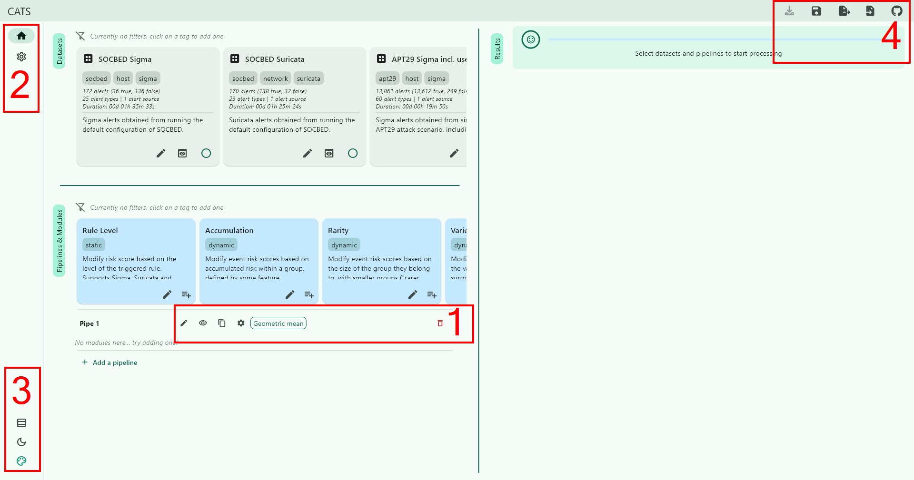

# CATS

- [Overview](#overview)
- [Usage](#usage)
  - [UI Overview](#ui-overview)
  - [Further Actions](#further-actions)
- [Additional Tools](#additional-tools)
  - [Normalizer](#normalizer)
  - [Batch Processor](#batch-processor)
- [Hosting Your Own Backend](#hosting-your-own-backend)

**C**ybersecurity **A**lert **T**riage Evaluation **S**ystem (CATS) 

## Overview

CATS is a novel, free tool for evaluating and visually exploring cybersecurity alert prioritization methods such as RBA.
It works on all major platforms and is separated into a front- and backend.
The latter is realized as a Python flask server, offering an API which is leveraged by the frontend application to offer a convenient and streamlined GUI to interact with said API.

Access the application [here](https://962012d09b.github.io/cats_webapp/).
Since all users share a backend in this demo, the underlying database is read-only - all operations that would write to it will fail.
You can host your own backend in 10 seconds following the instructions [here](#hosting-your-own-backend).

## Usage

### UI Overview
The main hub of CATS consists of three parts:
1) **Datasets**
   - Select which alert dataset should be used for analysis
2) **Pipeline & Modules**
   - Configure various pipelines to process the alert dataset with
3) **Results**
   - Displays the results of all pipelines



CATS example in action:
- Create a pipeline
- Add two modules to this pipeline (Accumulation & Rarity)
- Select a dataset (SOCBED)
  - First set of results is displayed
- Change the parameter of a module 
  - Second set of results is displayed



Instead of changing the parameters, you could also create a second pipeline and compare the two directly:



### Further Actions
1) **Pipelines Settings**:
Displayed at the top of each pipeline, you have a number of options to modify each pipeline:
   - Rename the pipeline
   - Show/Hide this pipelines results
   - Duplicate the pipeline
   - Change processing settings
     - Averaging method to use for individual module scores
     - Weight to assign to each module within a pipe
   - Delete the pipeline
2) **General Settings**
   - Mostly related to backend management
     - The demo backend is hosted at `X.X.X.X:XXX`.
   - Update the settings here if you choose to host it somewhere else
3) **QoL-Features**
   - Toggle between horizontal and vertical layout
   - Toggle light/dark mode
   - Select color palette
4) **Miscellaneous**
   - Download current results
   - Save current pipeline configuration or restore a previously saved one
   - Export current pipeline configuration as JSON string
   - Import a pipeline as JSON string
   - Visit repository



## Additional Tools

### Normalizer
Facilitates normalizing a dataset into the format expected by CATS.

-> [README](tools/normalizer/README.md)

### Batch Processor
Enables quick computation all possible configurations of a CATS pipeline given a set of modules to use by directly interfacing with the backend.

-> [README](tools/batch_processor/README.md)

## Hosting Your Own Backend
The backend should be hosted using Docker;
from the root of this repository, run:
```sh
# Preliminary step:
# If you are running Linux and have a non standard UID/GID (=/= 1000), which is unlikely, you need to specify that ID
# Otherwise, ignore this step
echo "USER_ID=$(id -u)" > .env
echo "GROUP_ID=$(id -g)" >> .env
```

```sh
# Start services in detached mode
docker compose up --build -d

# From then on, start and stop containers with
docker compose start
docker compose stop

# Troubleshoot: Delete the underlying database, which will be recreated on the next build
docker compose down -v
```
Modify the `docker_compose.yml` file if you wish to change ports and/or credentials.
In the application itself, go to Settings -> Backend and change the IP to `127.0.0.1` (or wherever else you chose to host your backend).